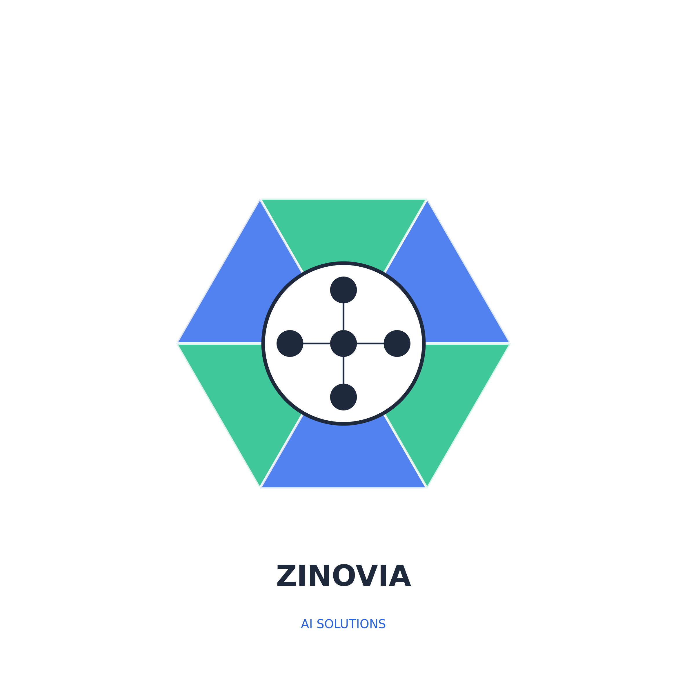

# Zinovia.AI - Enterprise AI Solutions Platform
## Executive Summary & Service Offerings

---

## 🚀 Company Overview

**Zinovia.AI** is a leading AI enablement company specializing in enterprise-grade automation solutions that transform businesses through intelligent automation. We deliver measurable ROI within weeks, not months, making AI accessible and practical for organizations of all sizes.

### Key Differentiators
- **Fastest Deployment in Industry**: < 24 hours from strategy to production
- **Proven ROI**: 2.5x average return in first year
- **Enterprise-Grade Security**: SOC 2 Type II, HIPAA, GDPR compliant
- **500+ Successful Projects**: Across multiple industries
- **98% Client Satisfaction**: Industry-leading customer success

---

## 💡 Core AI Solutions

### 1. **AI Chatbots & Virtual Assistants**
Transform customer engagement with intelligent conversational AI that understands context, emotion, and intent.

**Features:**
- 50+ language support with real-time translation
- Omnichannel deployment (Web, WhatsApp, Telegram, SMS, Email)
- Sentiment analysis and emotional intelligence
- Voice integration (voice-to-text, text-to-speech)
- Live agent handoff with context preservation
- Custom persona development for brand alignment
- A/B testing and conversation optimization

**Business Impact:**
- 68% reduction in support costs
- 24/7 availability without additional staffing
- 4.8/5 average customer satisfaction score
- 85% first-contact resolution rate

### 2. **Document Intelligence Platform**
Automate document processing with AI that reads, understands, and extracts information from any document type.

**Features:**
- OCR with 99.5% accuracy
- Multi-format support (PDF, images, Excel, Word, handwritten)
- Table extraction and structure understanding
- Smart categorization and routing
- Compliance verification (GDPR, HIPAA, SOX)
- Batch processing (millions of documents)
- Version control and change tracking
- Workflow automation

**Business Impact:**
- 73% cost reduction in document processing
- From days to minutes processing time
- 99.9% accuracy in data extraction
- Zero manual data entry

### 3. **Autonomous AI Agent Systems**
Deploy intelligent agents that work 24/7, make decisions, and execute complex multi-step workflows.

**Features:**
- Autonomous learning and adaptation
- Multi-agent collaboration and orchestration
- Complex reasoning and problem-solving
- 500+ API integrations
- Predictive analytics and forecasting
- Real-time monitoring and alerting
- Self-healing capabilities
- Custom knowledge graph construction

**Business Impact:**
- 4.2x productivity increase
- 85% process efficiency gain
- Predictive maintenance reducing downtime by 45%
- $450M+ in cumulative client savings

---

## 🏢 Industry-Specific Solutions

### **Financial Services**
- **Fraud Detection**: Real-time transaction monitoring with 99.2% accuracy
- **KYC/AML Compliance**: Automated customer verification in < 30 seconds
- **Risk Assessment**: AI-powered credit scoring and underwriting
- **Market Analysis**: Predictive trading signals and portfolio optimization

### **Healthcare**
- **HIPAA-Compliant Data Management**: Secure patient record processing
- **Clinical Decision Support**: AI-assisted diagnosis and treatment recommendations
- **Insurance Claims**: Automated processing reducing time by 80%
- **Patient Engagement**: Intelligent appointment scheduling and reminders

### **E-Commerce & Retail**
- **Recommendation Engines**: Personalized product suggestions increasing sales by 35%
- **Dynamic Pricing**: Real-time price optimization based on demand
- **Inventory Management**: Predictive stock optimization
- **Customer Service**: AI chatbots handling 90% of inquiries

### **Manufacturing**
- **Predictive Maintenance**: Reduce equipment downtime by 45%
- **Quality Control**: Automated defect detection with 99.7% accuracy
- **Supply Chain Optimization**: AI-driven logistics and procurement
- **Energy Management**: 30% reduction in energy consumption

### **Legal & Professional Services**
- **Contract Analysis**: Review contracts 10x faster with AI
- **Legal Research**: Automated case law and precedent research
- **Document Drafting**: AI-assisted document creation
- **Compliance Monitoring**: Real-time regulatory compliance tracking

### **Education & EdTech**
- **Personalized Learning**: Adaptive learning paths for each student
- **Automated Grading**: Instant assessment and feedback
- **Student Engagement**: AI tutors available 24/7
- **Performance Analytics**: Predictive student success modeling

---

## 💼 Service Packages & Pricing

### **Starter Package - $2,499/month**
Perfect for small teams testing AI capabilities
- 1 AI Solution deployment
- Up to 10,000 interactions/month
- Basic analytics dashboard
- Email support
- 14-day free trial

### **Professional Package - $7,999/month** ⭐ Most Popular
Ideal for growing businesses ready to scale
- 3 AI Solutions
- Unlimited interactions
- Advanced analytics & reporting
- Priority support (4-hour SLA)
- Custom integrations
- Dedicated success manager

### **Enterprise Package - Custom Pricing**
Complete AI transformation for large organizations
- Unlimited AI Solutions
- White-label options
- Dedicated development team
- 24/7 phone support
- On-premise deployment options
- Custom SLA guarantees

### **Additional Services**
- **AI Strategy Consulting**: $5,000 - $25,000
- **Custom AI Development**: $50,000+
- **Managed AI Services**: $15,000/month+
- **AI Training & Workshops**: $2,500/day

---

## 🔧 Technology Stack & Architecture

### **AI Models & Frameworks**
- GPT-4, Claude 3, Gemini Pro
- Custom fine-tuning capabilities
- Proprietary RAG (Retrieval Augmented Generation)
- Multi-modal AI support (text, image, voice)
- Continuous learning systems

### **Infrastructure & Deployment**
- **Cloud Platforms**: AWS, Azure, Google Cloud
- **Deployment Options**: Cloud, On-premise, Hybrid, Edge
- **API Architecture**: REST, GraphQL, WebSockets
- **Scalability**: Auto-scaling to handle millions of requests
- **Performance**: < 100ms response time

### **Security & Compliance**
- **Certifications**: SOC 2 Type II, ISO 27001
- **Compliance**: HIPAA, GDPR, CCPA ready
- **Security**: End-to-end encryption, SSO, MFA
- **Monitoring**: 24/7 security operations center
- **SLA**: 99.9% uptime guarantee

### **Integration Ecosystem**
- 500+ pre-built integrations
- Webhooks and real-time notifications
- No-code/low-code integration options
- Custom API development
- Legacy system connectors

---

## 📊 Implementation Process

### **Phase 1: Discovery (24 hours)**
- Requirements gathering and analysis
- Current state assessment
- Opportunity identification
- ROI projections

### **Phase 2: Strategy (48 hours)**
- Custom AI blueprint creation
- Technology selection
- Integration planning
- Success metrics definition

### **Phase 3: Development (1-2 weeks)**
- Solution building and configuration
- Integration with existing systems
- Testing and quality assurance
- User acceptance testing

### **Phase 4: Launch & Scale (Ongoing)**
- Production deployment
- Performance monitoring
- Continuous optimization
- Scaling and expansion

---

## 🎯 How We Deliver Value

### **For Business Leaders**
- **Measurable ROI**: Average 2.5x return in year one
- **Competitive Advantage**: Stay ahead with cutting-edge AI
- **Risk Reduction**: Proven solutions with guaranteed SLAs
- **Scalability**: Solutions that grow with your business

### **For IT Teams**
- **Easy Integration**: API-first architecture with extensive documentation
- **No Vendor Lock-in**: Open standards and portable solutions
- **Minimal Maintenance**: Managed services with 24/7 support
- **Security First**: Enterprise-grade security and compliance

### **For End Users**
- **Intuitive Experience**: User-friendly interfaces
- **Instant Support**: AI assistance available 24/7
- **Personalized Service**: AI that learns and adapts
- **Multi-language Support**: Global accessibility

---

## 📈 Success Metrics & Case Studies

### **Key Performance Indicators**
- **500+** Projects Delivered
- **98%** Customer Satisfaction Rate
- **73%** Average Cost Reduction
- **2.5x** ROI in First Year
- **15M+** AI Interactions Processed
- **$450M+** Total Client Savings

### **Case Study 1: TechRetail Inc.**
**Challenge**: High customer support costs and long response times
**Solution**: AI chatbot with omnichannel deployment
**Results**:
- 68% reduction in support costs
- 4.8/5 customer satisfaction score
- 90% of queries resolved without human intervention
- ROI achieved in 3 months

### **Case Study 2: FinanceFirst**
**Challenge**: Manual document processing taking days
**Solution**: Document Intelligence Platform with OCR and workflow automation
**Results**:
- Processing time reduced from days to minutes
- 99.9% accuracy in data extraction
- 80% reduction in operational costs
- Complete digital transformation in 6 weeks

### **Case Study 3: HealthCare Partners**
**Challenge**: Patient data management and compliance
**Solution**: HIPAA-compliant AI system for patient records
**Results**:
- 100% HIPAA compliance achieved
- 45% reduction in administrative tasks
- Improved patient satisfaction by 35%
- Zero security incidents

---

## 🛠️ Product Offering Framework

### **1. Pre-Built Solutions (Rapid Deployment)**
Ready-to-deploy AI solutions that can be customized for your needs:
- Customer Service Chatbot
- Document Processing System
- Sales Assistant AI
- HR Automation Bot
- IT Helpdesk Agent
- Marketing Content Generator

### **2. Custom AI Development**
Tailored solutions built specifically for your unique requirements:
- Custom AI model training
- Proprietary algorithm development
- Industry-specific solutions
- Legacy system integration
- White-label platforms

### **3. AI-as-a-Service (AIaaS)**
Flexible, subscription-based access to AI capabilities:
- Pay-per-use pricing models
- Scalable infrastructure
- Regular updates and improvements
- No upfront investment
- Instant deployment

### **4. Managed AI Services**
Complete AI operations management:
- 24/7 monitoring and support
- Performance optimization
- Model retraining and updates
- Capacity planning
- Incident management

---

## 🎓 Training & Support Services

### **Training Programs**
- **AI Fundamentals Workshop**: 1-day introduction to AI for business
- **Advanced AI Implementation**: 3-day hands-on training
- **AI Strategy Masterclass**: Executive-level strategic planning
- **Technical Deep Dives**: For IT teams and developers

### **Support Tiers**
- **Basic**: Email support, knowledge base access
- **Professional**: Priority support, 4-hour SLA
- **Enterprise**: Dedicated support team, 24/7 phone support
- **Premium**: On-site support, custom SLA

### **Resources**
- Comprehensive documentation
- Video tutorials and webinars
- Best practices guides
- Community forums
- Regular newsletters and updates

---

## 🚀 Getting Started with Zinovia

### **Step 1: Initial Consultation**
- Free 30-minute discovery call
- Needs assessment and opportunity identification
- Custom demo of relevant solutions
- ROI estimation and timeline

### **Step 2: Proof of Concept**
- 14-day free trial (no credit card required)
- Limited deployment to test effectiveness
- Success metrics tracking
- Regular check-ins and optimization

### **Step 3: Full Implementation**
- Complete solution deployment
- Integration with existing systems
- Team training and onboarding
- Go-live support

### **Step 4: Continuous Improvement**
- Regular performance reviews
- Optimization recommendations
- Scaling strategies
- New feature rollouts

---

## 🎯 Why Choose Zinovia?

### **Speed**
- Fastest deployment in the industry (< 24 hours)
- Rapid prototyping and iteration
- Quick time-to-value
- Agile development methodology

### **Expertise**
- Team of AI experts and data scientists
- Industry-specific knowledge
- Proven track record (500+ successful projects)
- Continuous innovation

### **Value**
- Best ROI in the market (2.5x average)
- Transparent pricing
- No hidden costs
- Flexible payment options

### **Partnership**
- Not just a vendor, but a strategic partner
- Dedicated success managers
- Proactive support and optimization
- Long-term relationship focus

---

## 📊 Competitive Advantages

| Feature | Zinovia | Competitors |
|---------|---------|------------|
| Deployment Time | < 24 hours | 2-6 months |
| ROI Timeline | 3 months | 12+ months |
| Pricing Model | Flexible, transparent | Complex, opaque |
| Support | 24/7, dedicated team | Business hours only |
| Customization | Fully customizable | Limited options |
| Integration | 500+ pre-built | < 100 typically |
| Success Rate | 98% satisfaction | Industry avg: 65% |

---

## 📞 Contact Information

### **Headquarters**
Zinovia AI Solutions  
Email: hello@zinovia.ai  
Website: www.zinovia.ai  
Phone: +1 (555) 123-4567  

### **Sales Inquiries**
Email: sales@zinovia.ai  
Schedule a Demo: www.zinovia.ai/demo

### **Technical Support**
Email: support@zinovia.ai  
Support Portal: support.zinovia.ai  
Emergency Hotline: +1 (555) 123-4911

### **Partnership Opportunities**
Email: partners@zinovia.ai  
Partner Portal: partners.zinovia.ai

---

## 🔮 Future Roadmap

### **Q1 2025**
- Launch of Voice AI Suite
- Expansion to 10 new industries
- Advanced computer vision capabilities
- Enhanced no-code platform

### **Q2 2025**
- Quantum computing integration
- Blockchain-based AI verification
- AR/VR AI experiences
- Global expansion (APAC, EMEA)

### **Q3 2025**
- Autonomous AI marketplace
- Developer ecosystem launch
- AI certification programs
- Strategic acquisitions

### **Q4 2025**
- Next-gen AI models
- Industry-specific AI clouds
- Complete automation suites
- IPO preparation

---

## 💪 Our Commitment

At Zinovia, we're committed to:
- **Innovation**: Continuously advancing AI capabilities
- **Ethics**: Responsible AI development and deployment
- **Success**: Your success is our success
- **Excellence**: Delivering best-in-class solutions
- **Support**: Being there whenever you need us

---

## 🎁 Special Offers

### **Limited Time Promotions**
- **New Client Special**: 20% off first 3 months
- **Annual Prepay Discount**: 2 months free
- **Referral Program**: $5,000 credit for each referral
- **Non-Profit Discount**: 30% off all packages

### **Free Resources**
- AI Readiness Assessment
- ROI Calculator
- Industry Reports
- Best Practices Guides
- Webinar Series

---

## ✅ Next Steps

1. **Schedule a Free Consultation**
   - 30-minute discovery call
   - Custom demo of solutions
   - ROI assessment

2. **Start Your Free Trial**
   - 14 days, no credit card
   - Full feature access
   - Dedicated onboarding support

3. **Join Our Community**
   - Monthly webinars
   - User forums
   - Case study library
   - Newsletter subscription

---

## 📜 Legal & Compliance

- SOC 2 Type II Certified
- HIPAA Compliant
- GDPR Ready
- CCPA Compliant
- ISO 27001 Certified
- PCI DSS Compliant
- Regular third-party audits
- Comprehensive insurance coverage

---

*© 2025 Zinovia.AI - All Rights Reserved*

**Transform Your Business with AI Today**  
🚀 Start Your Free Trial: www.zinovia.ai/trial  
📅 Schedule a Demo: www.zinovia.ai/demo  
📧 Contact Us: hello@zinovia.ai

---

*This document is proprietary and confidential. Distribution is limited to authorized personnel only.*

google-site-verification=Nwvw19LmaS7Y2JBpzbDl5Z5LsRi4GMc7Xo0T5R30D7g

	A	216.239.32.21
	
	A	216.239.34.21
	
	A	216.239.36.21
	
	A	216.239.38.21
	
	AAAA	2001:4860:4802:32::15
	
	AAAA	2001:4860:4802:34::15
	
	AAAA	2001:4860:4802:36::15
	
	AAAA	2001:4860:4802:38::15
